# Constraint Machine

## Introduction <a id="docs-internal-guid-047e2002-7fff-03af-0fbc-077c1f63e1f1"></a>

This document will walk through the design logic behind the Constraint Machine, one of the two middle layers in the Radix Engine.

The Constraint Machine is a concept that takes Bitcoin's UTXO model and expands it for generic programming. This machine runs constraint validation against new atoms and historical data.

The other middle layer is the [Atom Model](atom-structure.md), which takes that core generic programming language and provides much easier abstractions for developing correct state machines.


**Tip:** you can read more about the Atom Model structure in [this article](atom-structure.md).


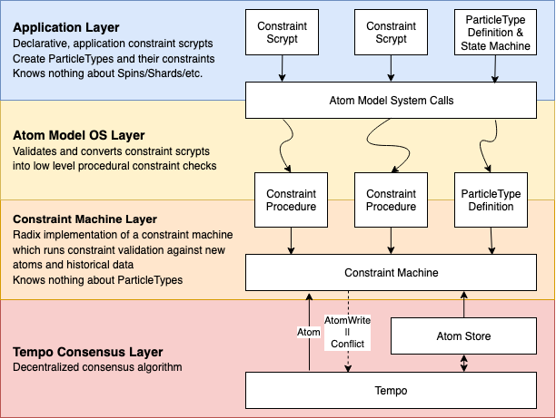

### Constraint Machines vs. Computing Machines

Before we dig in, let's explain why we are moving away from the blockchain virtual machine \(VM\) that made Ethereum and EOS so popular.

At a high level, the traditional computing machine computes a state. Being so generic makes it incredibly powerful, but it brings a few issues:

* It’s difficult to prove correctness
* It’s difficult to state shard

A Constraint Machine on the other hand validates a new state. This is similar to how Bitcoin validates new UTXOs. Although this is a drastic reduction in capability compared to the traditional computing machine, we get the following nice properties:

* Proving correctness is a lot easier
* State sharding is almost built-in

We judge this to be the right tradeoff when creating a distributed ledger, since:

* "Computation" is not something needed as users always know what state they want to get to \(we don't need a ledger to compute game physics\)
* Provable correctness is much more important than generic programming
* Distributed throughput does not come from computing speed but rather from parallel state sharding

## State Machines

The main use-case for generic development on top of a ledger, as made popular by Ethereum's Smart Contract, is implementing correct State Machines. To this end, the Atom Model is designed to provide a simple interface between State Machine management and the Constraint Machine.

We will now present some State Machine fundamentals, as it’s important for a Radix developer to be aware of these concepts.


A State Machine is a device which can be in one of a set number of stable conditions depending on its previous condition and on the present values of its inputs.


### State Machine definition

The definition of a state machine, defines its behavior and lifecycle. For example:  


### State Machine instance

A State Machine instance is an actual instance of a state machine with a particular state. There could be more than one instance for a defined State Machine. For example, here are two instances of the state machine defined above:  


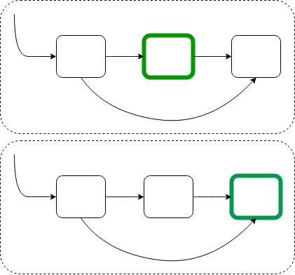

### Quantitative vs. Qualitative transitions

As a State Machine designer it is also important to understand Extended State Machines or the notion of Qualitative and Quantitative aspects of a state machine.

#### Quantitative Transition

These are transitions to the same state, where "extended state variables" of the state are updated. For example:  


#### Qualitative Transition

These are transitions to a different state. For example:  


## Particles

A particle can be defined as a "sub state of a global state", and it’s the fundamental block when developing on top of the Constraint Machine. When talking about particles there are two parts: a ParticleType and a ParticleInstance. The difference between the two is similar to the difference between State Machine Definitions and State Machine Instances. That is, a ParticleType defines the sub state and a ParticleInstance is an instance of that sub state.


**Tip:** you can read more about Particles and Particle types in [this article](particle-types.md).


### Particle Spins

Particle spins are the key on how particles transition to other particles.

Let’s take as an example, transitioning from a "5 dollars in my pocket" state to a "5 dollars in your pocket".  


#### How does the actual particle transition work?

Given that a particle represents a "sub-state", the spin of a particle represents whether or not it is "enabled" or not. In “Spin language”, UP \(enabled\) or DOWN \(not enabled\).

This means that a particle transition is represented by the current particle being spun DOWN and the next particle being spun UP.

Back with our example, the "5 dollars in my pocket" state becomes disabled while the "5 dollars in your pocket" state becomes enabled:  


Given this, low level particle state machine transition management comes into applying logic based on what particles must be spun **DOWN** for a particle to be spun **UP**.

## Particles and State Machines

Since particles represent a partial state which can be turned on and off, state machines are the perfect construct to manage particles.

There are two main State Machine Instance constructions, both of which use particles in different ways to represent a state:

* State Machine by index
* State Machine by transitions


**Note:** certain state machine transitions may be dependent on the state of other state machine instances. Currently state dependency is only supported on Indexable State Machine Instances.


### Indexed State Machine instance

In an indexed State machine instance, every particle has an index associated with it, which represents which state machine instance it is a part of.

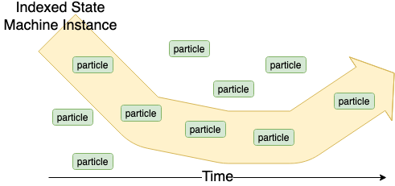


**Use case:** used mostly for cases where the states of a state machine definition are all located in the same shard \(they never moves in space\). For example, TokenDefinitions.


### Transition State Machine instance

In a transition State machine instance, every particle has defined what is the required current particle to be transitioned from/to.

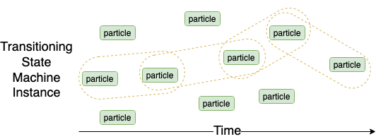


**Use case:** used for cases when a state machine instance can travel across shards. For example, TokenInstances.


### Indexed State Machine dependencies

An Indexed State Machine Instance transition can have dependencies on another Indexed State Machine Instance.

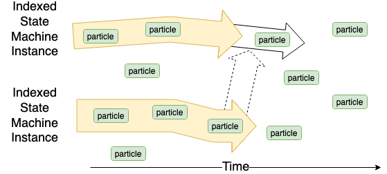


**Use case:** used for cases where multiple state machine definitions in the same shard have dependencies on each other. For example, Minting Permissions.


### Spin State Machines vs. Particle State Machines

Do not confuse the Spin State machine with the higher level Particle State Machine as they are different abstractions. The Spin State Machine describes the substates lifecycle, while the Particle State Machine describes a generic application object's lifecycle.

Following our “5 dollars” example, the next diagram shows the different level of abstraction between a Particle State machine and a Spin State machine:

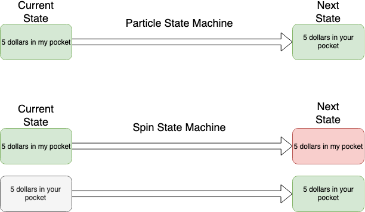

## Atom Model layer

The Constraint Machine is unaware of high-level abstractions such as ParticleTypes and state machines. Instead, it's language consists of: Atoms, Particles, Spins, Indices and Shards.

In order to fill the gap between high level scrypts and the constraint machine, the Atom Model layer converts the high level scrypts into two structures the Constraint Machine can understand:

1. ConstraintProcedures
2. ParticleTypeDefs

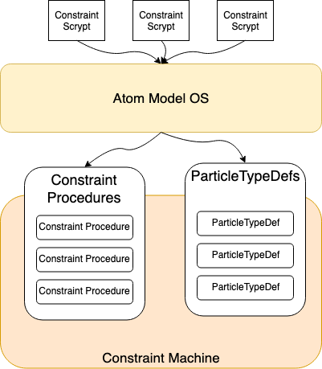

### Constraint Procedures

Constraint Procedures rely on Spin State Machine validations to the Constraint Machine, as the Constraint Machine has no knowledge of Particle state machines. The translation between the two is one of the roles of the Atom Model layer.

Constraint Procedures look like:

```java
/**
 * Read-only interface into historic particle data
 */
public interface ParticleStore {
  /**
   * Retrieves all particles with the given index
   * TODO: How to manage memory? Should this be paginated or turned into an Observable?
   * @param index index to look up
   * @return list of particles under index
   */
  public List<SpunParticle> getSpuns(EUID index);
}
/**
 * Validates a new particleGroup given historical ledger data.
 * On call to validate, can assume that particleGroup has already passed Constraint Machine invariants.
 * NOTE: not thread-safe when accessing store
 */
public interface ConstraintProcedure {
  /**
   * Validates a particleGroup
   * @param particleGroup particleGroup to validate
   * @param atomMetaData metaData from atom
   * @param store historic ledger store of particles
   * @throws ValidationException when a particleGroup does not pass all constraint requirements
   */
  public void validate(ParticleGroup particleGroup, AtomMetaData atomMetaData, ParticleStore store) throws ValidationException;
}
```

### Particle Type Definitions

In order to retrieve particles for future validations, they must also be stored in a predictable manner. This is given by ParticleTypeDef, another construct which the Constraint Machine can understand and one which the Atom Model layer must produce from the ConstraintScrypts.

These definitions have the following structure:

```java
interface ParticleWrite {
  /**
   * Returns the indices under which this particle should be stored
   * TODO: This should always have the destination encoded in it, perhaps there is a way to combine Index and Destinations?
   * @return set of EUID indexes in which this particle should be stored under
   */
  Set<EUID> getIndices();
  /**
   * Returns the destinations (i.e. shard + key) the particle should be stored in
   * @return set of EUID destinations in which this particle should be stored under
   */
  Set<EUID> getDestinations();
}
interface ParticleTypeDef<T extends Particle> {
  Class<T> type();
  SpinStateMachine lifecycle();
  ParticleWrite mapToWrite(T t);
}

```

### System Calls to Particle Type definitions

The system calls are the mechanism to define the creation and management of state machines using particles. The Atom Model layer creates ParticleTypeDef's dynamically based on all the system calls issued. That is, it can tell which indices and destinations are required by the scrypts alone.  


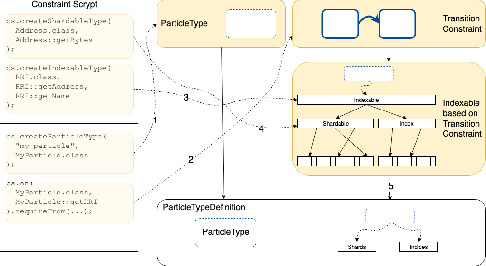

1. A Constraint Scrypt defines a certain ParticleType
2. A Constraint Scrypt defines constraints based on certain indexable data structures it needs
3. An indexable type was presumably defined in another scrypt to be used by other scrypts
4. A shardable type was also presumably defined in another scrypt to be used by other scrypts
5. Given the indexable type used by the constraint in 2, a mapping from an instance to it's destinations and indices can be created

## Constraint Machine

After the Atom Model layer converts all scrypts into ConstraintProcedures and ParticleTypeDefs, it passes all instances of these two structures to the Radix Constraint Machine.

Once the Radix Constraint Machine collects these instances, it can then validate and return write instructions for any new atom given some read-only Atom store.

Note that the Constraint Machine in this case does not update any state, it simply returns what the Atom Write should be without ever updating the Atom Store itself. Because of this, it is a purely functional component meaning that testing is much easier since there is no state maintenance to worry about.

At a high level this looks like:

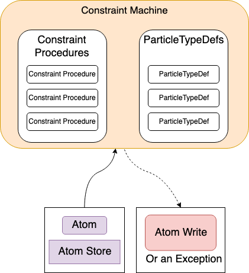

### Particle groups and dependent state changes

Given that there are multiple particle state transitions possible in an Atom, each of which are possibly dependent on another \(e.g. create a token and minting tokens for that token in the same atom\) there needs to be a mechanism for determining which state is relevant during validation of a constraint procedure. This is defined by the array of particle groups in an atom. Validation occurs with the following rules:

* Each particle group is validated sequentially
* Once a particle group is validated successfully, the state change of that particle group is recorded and available for subsequent particle group validations as "virtual state" \(only in memory not persisted to AtomStore\)

This means that state transitions which are dependent on each other should not go into the same particle group.

An example of how particle group processing occurs follows:

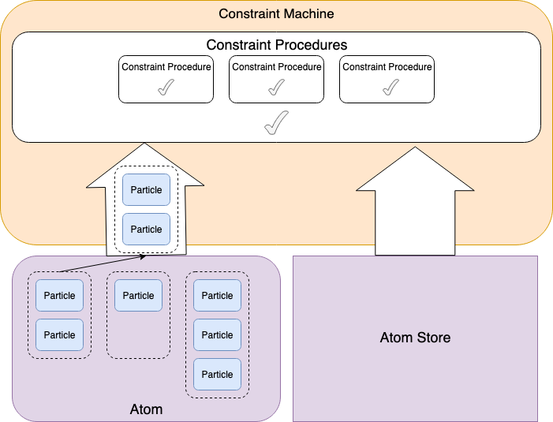

First particle group is validated with current atom store

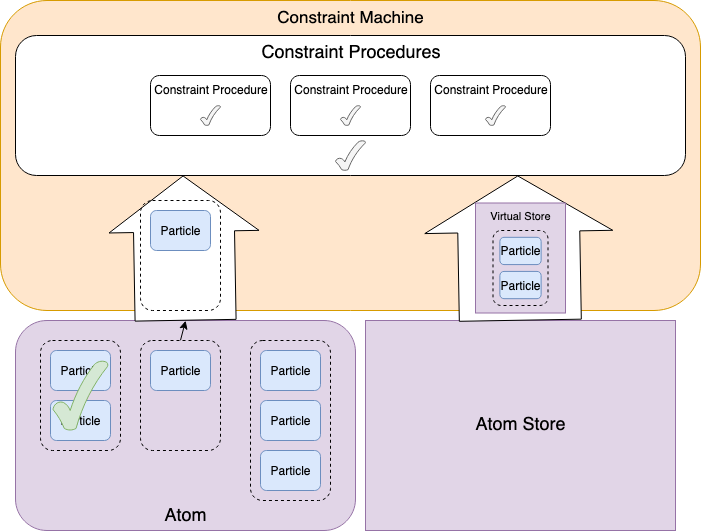

Given that the first particle group passes validation, the second particle group is validated with current atom store + state of first particle group

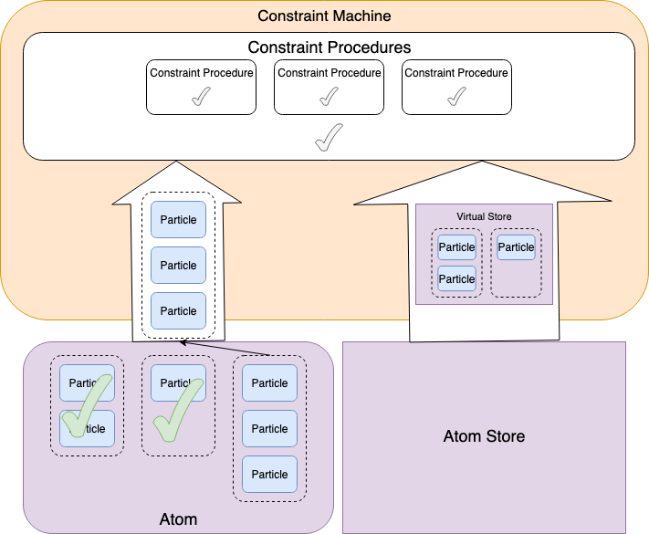

The same pattern continues until all particle groups have been validated successfully. On any failure, the machine will exit early and throw a ValidationException.

### Constraint Machine validation

Aside from constraint procedure validations there are other validations dependent on the machine itself. These are all validated prior to Constraint procedures.

For example: maximum atom size, timestamp metadata requirement or maximum number of shards.

### Indexing and sharding

Once all validation has passed the Constraint Machine then returns an AtomWrite which describes how the Atom should be indexed and stored. The Constraint Machine itself never stores state and in this way it can be seen as a purely functional component.

The indexing and sharding of an atom is determined by the particles contained within an atom. Specifically, the particleType of the particle along with the instance maps to a set of indices and shards determined by the Atom Model layer based on the constraint scrypts which define the state machine represented by each ParticleType. This is represented by ParticleTypeDef provided by the Atom Model layer.

Once all of the ParticleWrites are resolved, these are combined to produce an AtomWrite which the constraint machine is able to pass back to inform [Tempo](../whitepapers/tempo.md) how the atom should be stored.

If a ParticleType with no matching ParticleTypeDef is found, a Constraint Machine Validation exception is thrown.

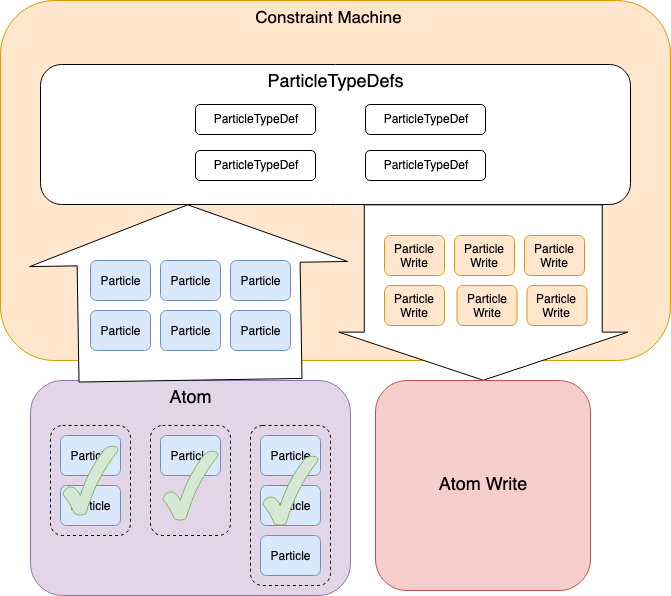

