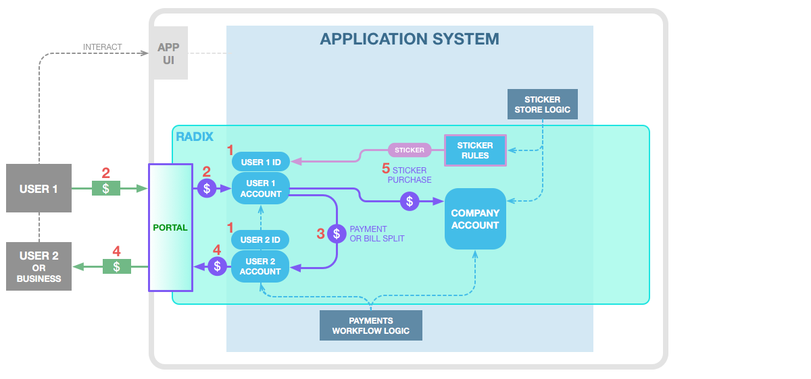
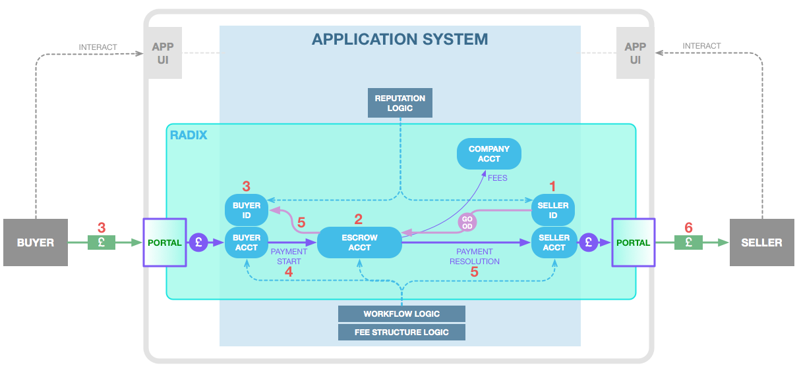
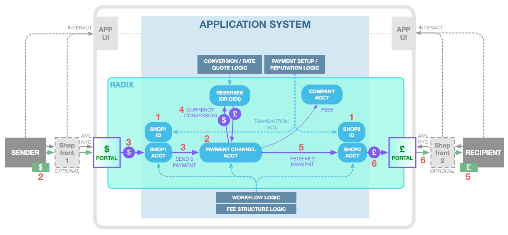
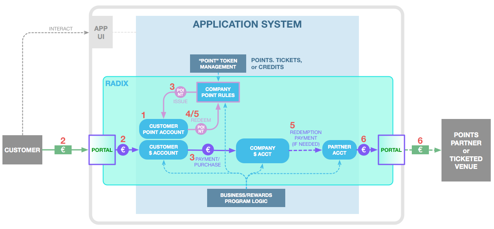
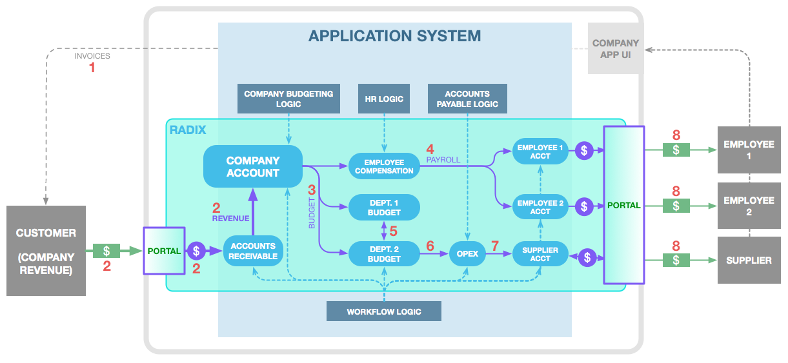
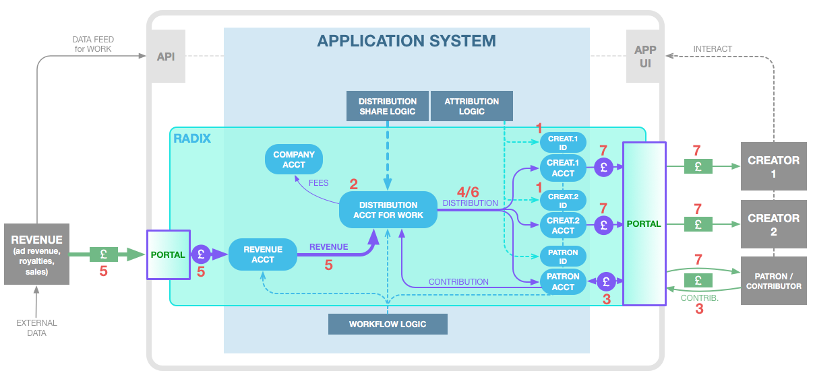
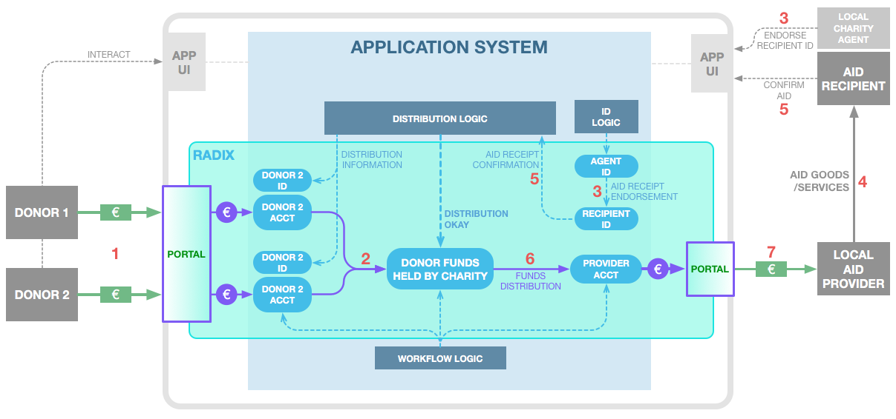

# Example Applications using Portals

## Introduction

Radix gives developers the platform to build applications that let individuals and companies transact with the same freedom, speed, and reach that the internet provides for information sharing today. The combination of Radix’ robust API-driven development and the infrastructure provided by Radix Portals and Fiat Tokens makes this next generation of internet-driven Accessible Fintech application possible.

Described below are several classes of applied Accessible Fintech. Each of these applications would traditionally require a complex and expensive fintech system, but are placed within the reach of any application developer using the Gateway, Infrastructure, and Universal Payments functionality provided by Radix and Portals. Development is contained to the user functionality the application developer cares about. The correctness, security, and resolution of financial transactions is provided by Radix itself rather than a complex system of custom software and a merchant bank.

Each application below is listed with specific example market use cases and key user/customer-facing features that the system provides. Also included is a simple diagram and brief description of the “In-Universe” user flow using the basic building blocks of Radix tokens, accounts, and transactions. These are only high-level descriptions of the major components of these systems. The intention is to get the application developer “thinking the Radix way” about how money and other critical assets of a business can be modeled, managed, and transacted.

## Application Class 1: Social Media P2P Payments

Description: Enabling peer to peer payments within social media, chat application, streaming service, or similar. Gives platform users the ability to send each other money directly, in the currency of their choosing.

Example Application Use-cases:

* Small debt settling/bill splitting
* Cash payment alternative for point-of-sale purchases \(e.g. stores, restaurants, services\)
* Simple digital storefronts, such as stickers/badges/digital collectables

Key Features:

* Payments sent/received in local currency
* Support payments natively within app/platform without needing PCI compliance or similar
* Fast, cheap and secure payments both between users and with the business
* Easy to integrate into an existing platform

Radix in-Universe User Flow:

1. Users 1 and 2 register with the Social Media Application. Application creates in-Universe User IDs and Accounts for each.
2. User 1 wishes to pay User 2 $5. Thinking they might make other payments in the future, User 1 onboards $20 \(with a Portal integrated into Application\) which become 20 $ Tokens and are put in their User 1 Account.
3. User 1 makes the payment to User 2 within the Application, moving 5 $ Tokens into User 2’s Account. \(This could also be a payment to a business that accepts payments within the Application as a form of digital cash.\)
4. Seller may, as she prefers, withdraw the £ Tokens to £ through the Portal within the Application. Or she may choose to keep the tokens to make payments later.
5. Now User 1 wishes to buy a Sticker pack for use within the Social Media Application for $2. He makes the purchase in the Application, causing 2 $ Tokens to move from his Account into the Company Account and an in-Universe representation of Sticker pack ownership to move into User 1’s ID – in a single in-Universe step.

## Application Class 2: P2P Marketplaces

Description: A global marketplace \(C2C/B2C/B2B\) enabling a mass market of users to transact directly between each other freely and securely in their own currencies.

Example Application Use-cases:

* * P2P product sales \(aliexpress/ebay/craigslist\)
  * Direct-to-consumer advertising payments
  * User data/demographics/location monetisation
  * Gaming asset exchange
  * Direct photo/music licensing

Key Features:

* * Payments sent/received in local currency
  * App UI to interact with the marketplace
  * Secure reputation & transaction tracking
  * Secure escrow of payments during transactions

Radix In-Universe User Flow:

1. Seller registers with the Marketplace Application. Application creates an in-Universe Seller ID and Account. Seller advertises a good or service on the marketplace. This may be represented by a Goods Token.
2. Buyer and Seller agree, through the application, to a purchase. Application creates an Escrow Account associated with the sale and moves the Goods Token into the Escrow, temporarily locking that Good/Service.
3. Buyer onramps £ \(with a Portal integrated into Application\) which become £ Tokens and are put in a Buyer Account also created by the Application.
4. Buyer’s payment is taken from his Account and moved into the Escrow Account.
5. Once the Application has verified that all terms of the sale have been satisfied, the £ Tokens move to the Seller Account and Goods Token to the Buyer Account in a single step. Application may also update reputation associated with each user \(or do so later\). The transaction is complete, with funds transacted, and transfer of goods securely registered.
6. Seller may, as he prefers, withdraw the £ Tokens to £ through the Portal within the Application.

## Application Class 3: Global P2P Payment/Remittance

Description: A global cash remittance system for individuals with instant global reach and low costs. This could be a pure mobile-enabled P2P system, or in some regions there may be a need to include local shop fronts that focus on direct cash capability.

Example Application Use-cases:

* * Western union style international cash remittance
  * International bank wire transfers
  * PayPal/Monzo-style P2P payments

Key Features:

* * Senders and recipients may use exclusively local currency.
  * Secure reputation tracking for all participants
  * Ability to convert between currencies during transactions
  * Connect users through app on both ends to arrange, initiate, and verify payment
  * Optionally enable owners of non-bank local shop fronts within each region to join the system

Radix In-Universe User Flow \(example including shop fronts\):

1. Shop fronts such as convenience stores, interested in serving as cash send/receipt points for local users, register in the Remittance Application. Application creates an in-Universe Seller ID and Account for each.
2. Sender brings $100 to Shopfront 1 in the USA to send to Recipient in Great Britain. Shopfront 1 uses the Application to connect the Sender’s  with the intended Recipient and Shopfront 2 in Great Britain. A Payment Channel Account is created for the remittance transaction.
3. Shopfront 1 accepts the cash and onramps it, perhaps minus his fee, \(with a Portal integrated into the application\) which becomes $ Tokens in Shopfront 1 Account. The $ Tokens are moved into the Payment Channel Account.
4. The Application converts the $ Tokens to equivalent £ Tokens at current spot price, either using held Token funds in a Reserve account, or using Radix’ Decentralized Exchange \(when available\).
5. Recipient identifies herself at Shopfront 2 and is provided her £ value of the original $100 \(minus fees\). £ Tokens move to Shopfront 2 Account and the transaction is considered complete when Shopfront 2 verifies delivery to Recipient.
6. Shopfront 2 may withdraw £ Tokens to £ through a local £ Portal, either immediately or perhaps waiting for a week’s transactions to withdraw all at once to its bank account.

## Application Class 4: Incentive Programs & Ticketing

Description: A system to manage the end-to-end life cycle of points, tickets, accounts, or gift cards including purchase, management, expiration, and redemption.

Example Application Use-cases:

* * Points and repeat customer loyalty systems
  * Event ticket purchase and redemption
  * Account charging/top-ups \(mobile phone, transit card, etc.\)
  * Retail gift cards

Key Features:

* * Purchases, top-ups, redemptions, and cash-outs all possible in local currency
  * Secure management of gift cards/points/account balances, and single-step swaps between these and with local currency
  * App portal to user the service and access gift/points/account balance
  * Provides simple integrations for payments to partner companies participating in point system

Radix In-Universe User Flow \(example loyalty point system\):

1. Customer registers with the Application provided by a Company that uses loyalty points. Application creates an in-Universe Accounts for the Customer’s $ and Points.
2. Customer charges their account with $50, onboarding funds \(with a Portal integrated into Application\) which become 50 $ Tokens that are credited to his Customer Account.
3. Customer makes a purchase with Company for $15. Application moves 15 $ Tokens from Customer $ Account to a Company Account. Company provides points equal to $ spent and so Application also issues 15 new Points Tokens to Customer Point Account.
4. Company allows customers to redeem points 10:1 for Company credit; customer wishes to redeem 10 of his Points for credit. Application removes 10 Points from Customer Point Account \(destroying them\), and moves 1 $ Token from Company Account to Customer $ Account.
5. Company has a partnership with another company where Company is willing to buy gift cards at 2:1 Points value. Partner is registered with Application and has a Partner Account. Customer wishes to redeem his remaining 5 points for a Partner gift card. Application removes 5 Points from Customer Point Account \(destroying them\), and moves 2.5 $ Tokens from Company Account to Partner Account \(along with information on Customer needed to provide gift card\).
6. Partner may withdraw $ Tokens to $ through the Portal, either immediately or perhaps waiting for a week’s transactions to withdraw all at once to its bank account.

## Application Class 5: Company Accounting/Payments

Description: A business operations system that unifies the functions of monetary in/outflows, internal budgeting, and accounting. Because the business and accounting systems interact directly with tokenized funds, “closing the books” becomes an outdated concept and a bank reconciliation becomes an afterthought \(if needed at all\) rather than a high-friction part of business operations.

Example Application Use-cases:

* * Internal departmental budgeting and tracking
  * Employee payroll
  * Contractor/supplier payment
  * Customer invoicing and payment

Key Features:

* * Incoming revenue and outgoing payments/payroll paid in local currency
  * Secure internal management and tracking of funds throughout the business, including departmental budgeting, accounts payable/receivable, and employee compensation
  * External company UI for employees and suppliers to manage accounts, etc.

Radix In-Universe User Flow \(example manufacturing company\):

1. Company sends an invoice to Customer for shipped product, directing them to use their Application to make payment.
2. Customer makes payment \(via Portal integrated into the Application\), with $ funds being issued as $ Tokens and credited to Company’s preconfigured in-Universe Accounts Receivable Account. Once Accounts Receivable has verified the payment, funds are moved to a master Company Account as revenue.
3. According to budgeting process, funds are allocated by moving $ Tokens from Company Account to each of three department Accounts: Employee Compensation, Department 1, and Department 2.
4. HR has onboarded Employees 1 and 2, creating Accounts for them. Payroll is run by distributing $ Tokens to these Accounts.
5. Meanwhile Department 1’s head agreed to give up some budget, moving $ Tokens from its Account to Department 2 Account.
6. Department 2 allocates a portion of its budget, moving $ Tokens to its own OPEX Account, from which it can pay suppliers of parts it needs for manufacturing.
7. Accounts payable has set up Supplier in Company’s system, creating a Supplier Account for them. Department 2 pays supplier for some parts, moving $ Tokens from its OPEX Account to Supplier’s Account.
8. Both Employees and Supplier may withdraw $ Tokens to their bank account through the Portal within the Application, perhaps automatically.

## Application Class 6: Revenue Distribution and Sharing

Description: A system to distribute revenue from a work \(whether advertising revenue, royalty payments, sales, or other\) to both creators and patrons/contributors according to rules set by the creator and the business – instantly, internationally, and cost effectively.

Example Application Use-cases:

* * Funding and royalty payment for music
  * Distribution of ad revenue from videos or other creative works
  * Musician crowdfunding and royalty payments
  * Artistic patronage systems

Key Features:

* * Payments made to creators and backers in local currency
  * Acceptance of revenue and data streams from third party sources in local currency
  * App UI for creators and patrons/contributors
  * Secure tracking of work attribution and distribution share splits

Radix In-Universe User Flow \(example music royalty distribution\):

1. A singer and songwriter \(Creators 1 and 2\) wish to gather funding for a new album via Company’s Application. They register with Application, and Application creates an ID and Account for each in-Universe.
2. Creators agree to provide 1% of the royalty revenue for their album for each $1000 contributed to its creation. Application creates a Distribution Account, with associated rules for how royalty revenue should be distributed: Some provided proportionally to contributors and the remainder split 50:50 between the Creators.
3. A fan, Contributor, decides to contribute $500 to the making of the album \(giving her rights to 0.5% of revenue\). She onboards funds \(using a Portal within the Application\), with 500 $ Tokens issued and credited to a Contributor Account created in-Universe by Application.
4. Application splits the contribution 50:50 between the creators. The album is created and released.
5. Company has a relationship with a digital music store, and has created a Revenue account for this store to flow revenue from album sales into Company’s Application \(once again via Portal\). In the first month, the Creator’s album generates $10,000 in revenue which are received as $ Tokens and moved into the Distribution Account for the album.
6. Revenue is distributed automatically in a single step via a collected set of $ Token transfers: 50 $ Tokens for Contributor, and 4975 $ Tokens for each of the Creators.
7. Creators and Contributor may withdraw $ Tokens to their bank account through the Portal within the Application.

## Application Class 7: Charitable Giving

Description: A system to accept donated funds and distribute them securely and correctly to local providers of aid \(hospitals, food distribution, etc.\). Funds are distributed to aid providers after aid is actually received - with the recipient attesting that they have in fact received the aid. This system would be for charities with a local presence, able to provide identification of aid recipients. Donors also can be given the ability to see where their donations have truly been distributed and the aid provided as a result.

Key Features:

* * Donations received in fiat currency, and aid providers able to receive funds in fiat currency
  * App UI for local charity agents and aid recipients to register and attest to aid received
  * App UI for donor interaction and viewing of distribution information
  * Logic to ensure funds are distributed only when the correct corresponding aid has been provided

Radix In-Universe User Flow:

1. Donors register in the Application, resulting in in-Universe Account and ID being created for them, and onboard funds \(using a Portal within the Application\) with € Tokens issued into their Accounts.
2. Donors contribute funds to a cause, with € Tokens moving into a Funds account for the Charity.
3. Meanwhile, an Agent for the Charity identifies an individual Recipient who needs Aid, helping them register and endorsing their identification. The Agent’s in-Universe ID creates and endorses a new Recipient ID in-Universe.
4. A Local Aid Provider, previously registered by the Charity with an in-Universe Account, provides Aid \(in the form of goods or services\) to the Recipient.
5. The Recipient uses the Application \(or is assisted by the Agent\) to positively attest to having received the Aid, with an in-Universe message confirming the Aid receipt.
6. As a result, funds are automatically distributed to the Provider, with € Tokens moving from the Charity Fund to the Provider Account.
7. Provider may withdraw € Tokens to their bank account through the Portal in the Application.

