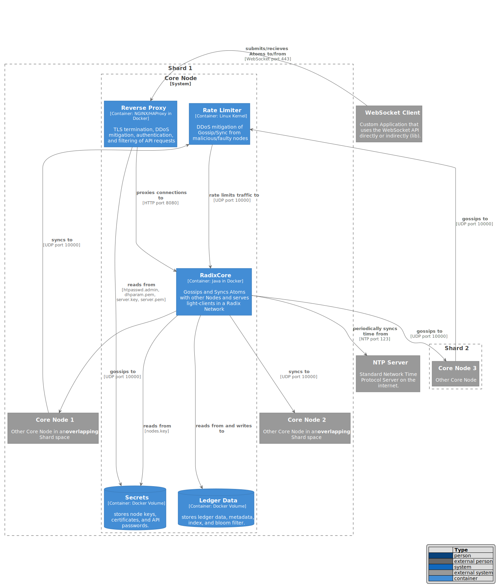

# Container Diagrams

## Level 2: Radix System Container

This page implement the second "C" in the [C4Model](https://c4model.com/#coreDiagrams): the **C**container Model.

It recommended that you understand the [Context Model](c4_context.md) \(first "C"\) before moving on to this page.

Our Containers are implemented in [Docker](https://www.docker.com/) and thus are compliant with the [Open Container Initiative](https://www.opencontainers.org/) \(OCI\)

## Single Point Of Failure \(SPOF\)

One of the most important architectural benefits with OCI Containers is modularity. For example: it is relatively easy to switch out the Reverse Proxy Container \(below\) from NGINX to [HAProxy](http://www.haproxy.org/). Modularity enables alternate Core Node System compositions, which will minimise the risk of single point of failures in a Radix Network. The long-term plan is to have alternate implementations of all Containers including RadixCore.

## Security

Our beloved RadixCore is implemented in Java. To protect the RadixCore, we have introduced some specialised Containers \(Reverse Proxy, Rate Limiter\) in front of it.

Correctly implemented OCI Containers improve security vs. running the app directly on the host machine. It is also possible to run OCI Containers on hypervisors with tools like [Kata Containers](https://katacontainers.io/), which improves isolation between Containers and Host even further.

## Core Node System Containers

At this level we do not discrimate between the Core and Boot nodes since they are identical and in normal case run the same Software stack + configuration.

### Reverse Proxy

This Container is designed to offload/protect the RadixCore API with:

1. TLS \(1.2\) Termination
2. DDoS mitigation through
   * Rate-limiting of Connections/bandwidth
   * Caching API Requests
3. HTTPS \(L7\) Filtering of Requests
4. Authentication to protected end-points

#### Alternatives

* [NGINX](https://www.nginx.com/)
* [HAProxy](http://www.haproxy.org/)
* [Apache2](https://httpd.apache.org/)

### Rate Limiter

This Container is responsible for configuring the Host Kernel to protect the RadixCore from attacks targetting the Sync/Gossip protocol, which is over UDP.

#### Alternatives

* [iptables](https://linux.die.net/man/8/iptables)
* [eBPF/XDP](https://www.netronome.com/blog/bpf-ebpf-xdp-and-bpfilter-what-are-these-things-and-what-do-they-mean-enterprise/)

### RadixCore

Please read [Core Nodes](c4_context.md).

#### Alternatives

* Java implementation

