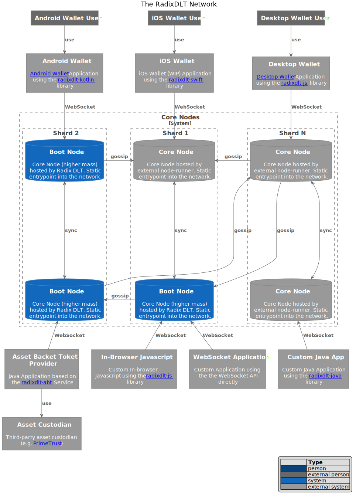

# Context Diagram

## Level 1: Radix System Context

This page implement the first "C" in the [C4Model](https://c4model.com/#coreDiagrams): the **C**ontext Model.

All production Systems \(External and Radix\) and Users that are commonly found on Radix networks are introduced on this page.

## Universes

Described in detail in the Radix [Whitepaper v2](https://papers.radixdlt.com/tempo/v2/).

From an architectural point of view, a Universe identifies an overlay network on top of Internet or in a LAN. Core/Boot nodes can be configured to be part of a specific universe.

## Atoms and Particles

Described in detail in the Radix [Whitepaper v2](https://papers.radixdlt.com/tempo/v2/).

On an Architectural level an Atom is a database transaction containing a totally ordering sequence of state transitions \(i.e. Particles\), which must be validated as a unit and committed to the Ledger \(DB\) atomically.

The minimal unit of transactional data transferred over wire \(sync/gossip/WebSocket\) and persisted in nodes is thus an Atom.

## Shards and Chunks

Described in detail in the Radix [Whitepaper v2](https://papers.radixdlt.com/tempo/v2/).

Sharding enable Radix Networks to have unlimited scalability. This is achieved by splitting up global state \(Ledger\) to different nodes in a deterministic way. The key of this sharding scheme is to be able to tell where in the shard space a certain state transition \(i.e. Particle, transaction\) is located, rendering double-spends and other attack vectors on "opposite sides" of the network impossible because e.g. a certain spend can only come from a single place i.e. shard.

The minimal Shard space that a nodes can serve is one Chunk. The number of Chunks served depends on the hardware configuration \(CPU, MEM, I/O\) of a specific node. Each node has advanced algorithms for monitoring its own performance and dynamically - to other nodes non-deterministically - scale up and down the number of chunks served.

Nodes in an overlapping Shard space are redundant to each other, which means that they persist and validate the same transactions.

## Mass Consensus

[Whitepaper v2](https://papers.radixdlt.com/tempo/v2/)

Mass is a Node property. Well-behaved Nodes of a Radix Network gain mass over time. Mass determines the power each node has in a Consensus agreement where temporal resolution is not possible.

## Boot and Core Nodes

Boot nodes and Core nodes are running identical software and configuration, the only difference is that Boot nodes are hosted by Radix and protect the public network in its infancy, while its more susceptible to 51% attacks.

The Universe configuration identifies a set of Boot nodes, which:

* are hosted by Radix
* have substantial amount of mass from start

### Centralisation of Mass

The goal is to give Boot nodes extra power until a nework is young and is vulnerable to 51% attacks. This additional mass is calculated such that it will dilute over time with a marginally successful \(number of Nodes\) network. The more successful network the faster the community Core nodes will gain mass and make the Boot nodes less powerful in the network.

## Core Nodes

Core Nodes are responsible for:

* Validating all transactions based on current Chunk state.
* Store all transactions that are originate and target to/from its Chunks.
* Allow submission of atoms from Light Clients throuhu a WebSocket API.
* Dispatch ledger events to Light Clients that are subscribed.
* Sync Ledger database with Peers in the same Shard Space.
* Gossip about transactions with Peers in any/all Shards \(structured gossip; not flooding\).

## Development Services

Developlment Services are deliberately left out from the Architecture, because those are only available on Test networks and will not be available on the production-grade networks. The services in question make it easy for newcomers to setup a test node and connect to various test networks. For better understanding, we provide the following Development Services:

* Radix NodeName Service
* Radix Node Discovery Service

_But these are cool service, why can't we use them in production?_

Hard dependency towards these services lead to centralisation, which is exactly what we are trying to prevent.

