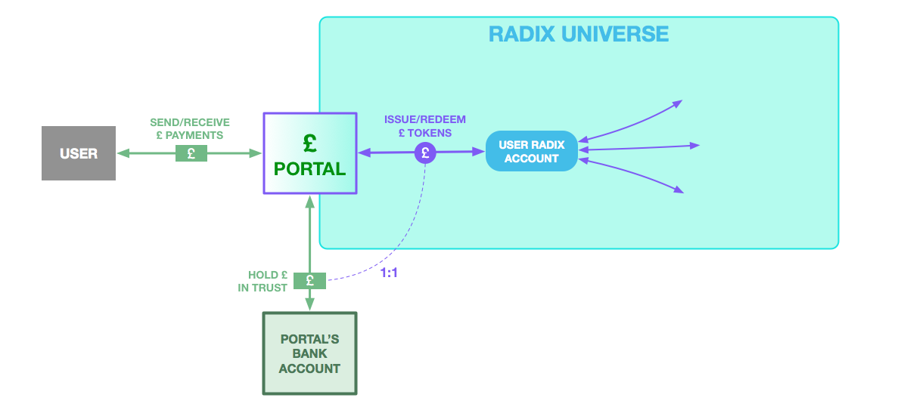

# Portals into the Radix Financial Universe

A full instance of the Radix platform running on a network of nodes is called a “Universe”. Radix supports a single public Universe for use by anyone on the open internet, and private Universes are also possible \(more on this below\). Radix Universes are immensely powerful to conduct financial transactions. But for a Radix Universe to be truly useful for real world businesses and users, it must carry real world currencies such as dollars, pounds, euros, yen, and renminbi. Radix Portals provide this service.

Portals transform money outside the Radix Universe into money within it. Portals accomplish this by accepting and holding everyday “fiat” funds, and issuing corresponding Fiat Tokens into the Radix Universe. These Fiat Tokens are programmable representations of money that can be freely used by applications, businesses, and individuals within the Universe.

Radix Portals are independent service providers connected to the Radix Universe. A Portal can be any company with a bank account that is able to hold customer/client money on behalf of those customers or clients. Portals hold money on behalf of the Radix Universe itself, where the corresponding Fiat Tokens may freely circulate between users. As the Portals are the interface between the Radix Universe and the real banking system, Portals also deal with much of the KYC/AML requirements around handling money. In most cases Portals will be regulated financial institutions, such as custodial trusts, but not necessarily in all cases.

A Radix portal requires four features to be able to provide Fiat Tokenization service to third parties:

1. A money services license \(or similar, as required for the local legal jurisdiction\)
2. A bank account to which third party money can be onboarded and offboarded
3. KYC/AML capability when on/offboarding funds
4. An open API/SDK to allow direct app integration of funds transfer and KYC/AML processes

These four features collectively allow app developers to provide a pass-through onramp and offramp to their customers and users, allowing them to onboard money to their ecosystem within their application without taking on the regulatory burden of administering that money directly. Although currently most Portals currently require the user to visit the website of the Portal provider for registration, we are working closely with them to make sure that this entire journey can be done without leaving the developer’s application to make the onramp journey as smooth as possible.

Once onboarded through a Portal, a customer’s money is turned into Fiat Tokens and credited to a Radix account associated with that customer. These tokens are now available for direct control by the developer via the Radix APIs and SDKs.

For the majority of developers, companies and users, Fiat Tokens remove the need to use complex, expensive, and slow bank services. Portals ensure that each Fiat Token can, whenever desired, once again become traditional money, exiting the Radix Universe through the same Portal into which it entered.

#### Example:

A Euro Portal accepts accept Euros via bank transfer, credit card, or cash. It then issues Euro Fiat Tokens into the Radix Universe in a 1:1 ratio. These Euro Fiat Tokens can simply be thought of as “Euros” within the Radix Universe. A business might use them to; operate a thriving marketplace application; conduct its own accounting; or pay its employees.

A user of that application can then opt to use the Euro Tokens they receive from one user to buy from another user. That user may then use those Euro Fiat Tokens to repay a colleague for lunch, or maybe send some Euros to a friend on the other side of the globe instantly. Those Euro Tokens may then be exchanged for Dollar Tokens and then withdrawn locally from a US based Portal.

These Fiat Tokens make the transfer and ownership of funds instant, global and interoperable. Whenever anybody needs to Portal out to old fashioned Dollars or Euros, the respective portals would allow them to do so.

