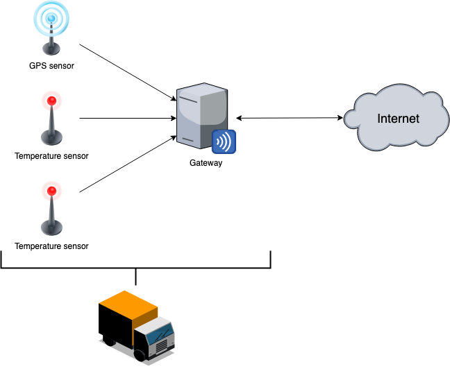
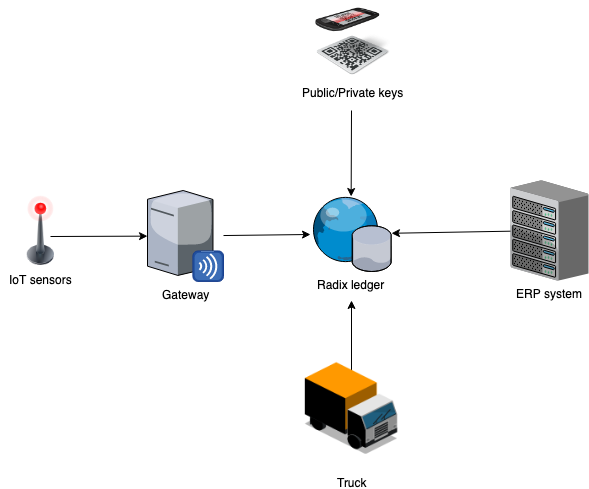
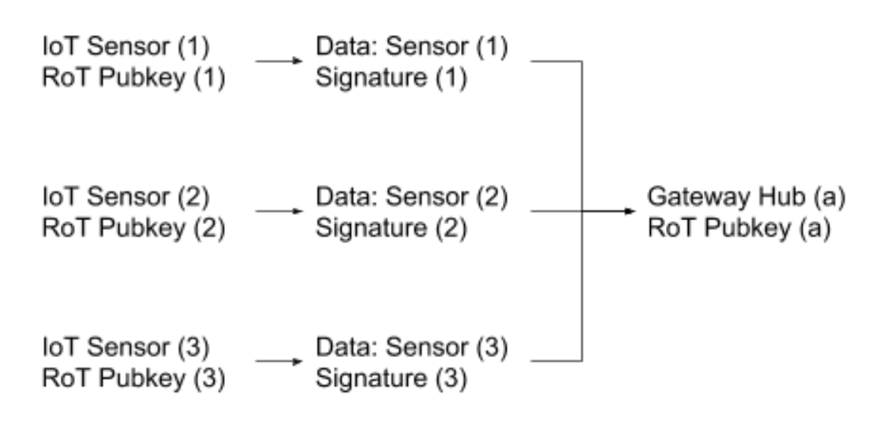
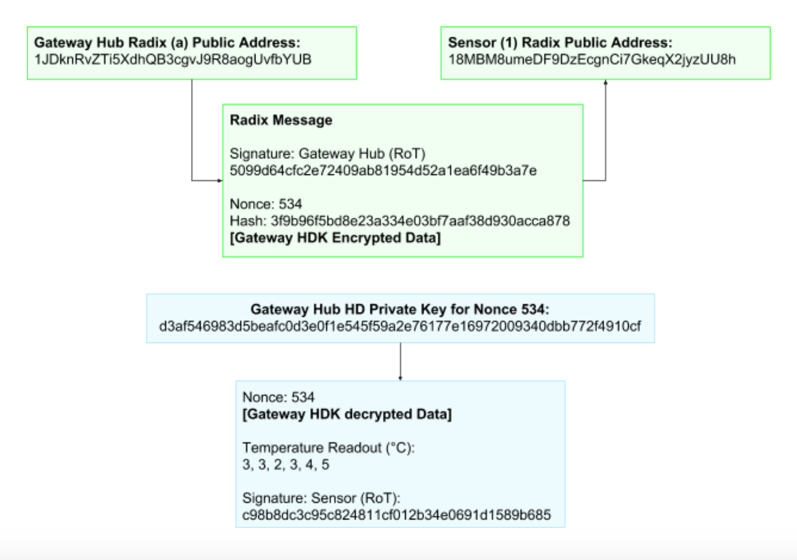
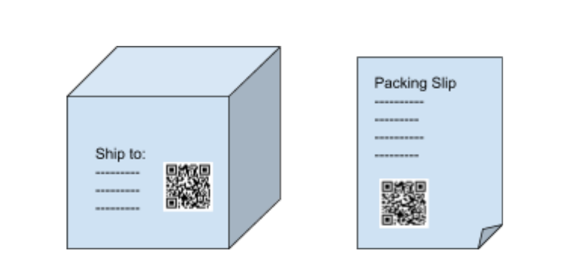
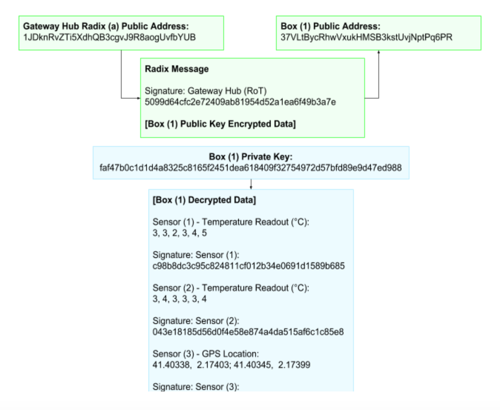
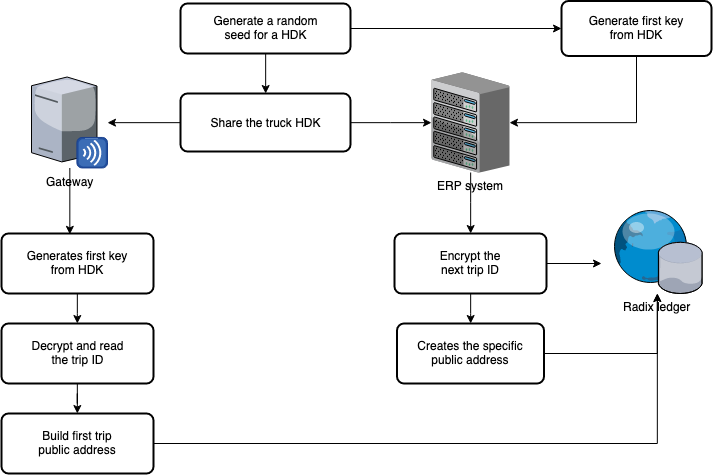
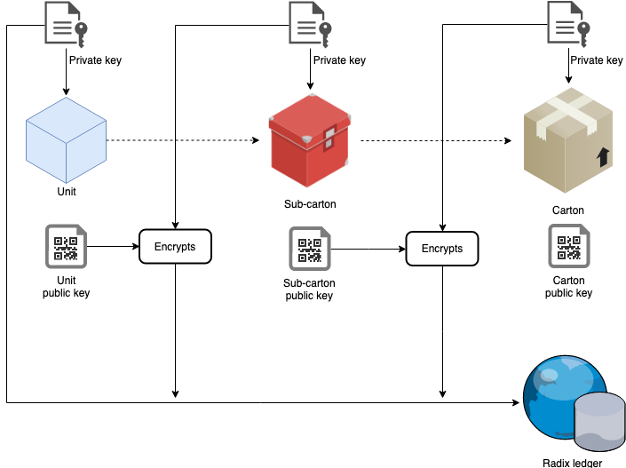
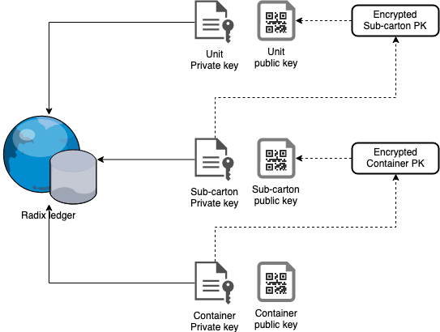

# Internet of Things

## Introduction

IoT Data is often required to be accessed by many parties; not all of them are necessarily co-operative, or not all necessarily know each other.

The goal of this document is to explore some possible ways to use the Radix ledger to give all parties a universal data layer from which only the allowed information can be recalled by each party that needs it.

### Temperature controlled logistics

The shipment of temperature controlled goods globally is a complex problem, as these goods often move between multiple logistics companies, distributors, and suppliers before arriving at their final destination.

Even for a single, international logistics company, the data from the offices in one country may not be transportable to another country office. This means giving strong, verifiable guarantees that goods never moved outside of a specified temperature band from source to delivery is often very difficult.

Even if every truck and warehouse is temperature controlled, each company has its own database for keeping and storing the data.

### Case outline

For this case study, let’s assume that we have a temperature controlled delivery truck. The truck has three IoT sensors; two that monitor the temperature of the truck every 10 seconds, and one that tracks the GPS location. These three sensors report into a gateway hub that is responsible for providing an internet connection for the sensors.

The delivery truck is used by five medicine companies, each in a different delivery location, each shipping 20 boxes, and each requires the boxes in the truck never to exceed 5 degrees Celsius during transit.

There are three fundamental problems to solve here - how can each company:

1. Access the in-truck temperature data for their box delivery?
2. Verify that the information has not been tampered with?
3. See the information for the entire refrigeration chain, not just one hop?

The objective of this case study is to answer these questions and outline how a box may be given a Radix ledger identity, and how that identity may be used as a global database pointer for each logistics company to write auditable information to.

This refrigerated chain is particularly important for the shipment of medicines but can be applied to anything from dairy to fresh lettuce.

## Proposed solution

To design a decentralized solution for the outlined scenario, we have identified the following required components:

1. The Radix ledger - the public database that will be used as the universal data layer
2. IoT sensors - with a hardware [Root of Trust](https://www.thalesesecurity.com/faq/hardware-security-modules/what-root-trust) \(RoT\)
3. Gateway Hub - with the ability to re-encrypt information and connect to the Internet
4. Public/Private keys with QR stickers
5. A truck \(also with a Radix ledger identity\)
6. ERP system

### 1. The Radix Ledger

The easiest way to think of the Radix ledger is like a massively sharded database. This shard space is static - 18.4 quintillion shards \(2^64\), and Radix uses the account’s public key address as the only input required to determine where any given account/address lives.

This makes the data structure incredibly efficient because any given wallet or account address only needs to return 1/\(2^64\) of the data stored on ledger during a read operation, and any data can be written directly to the correct shard without any coordination from the nodes.

This is very similar to how [Hash Tables](https://en.wikipedia.org/wiki/Hash_table) operate, but where each hash reference is a shard rather than a line in a database.

For IoT, this means that a large amount of data can be organized in a highly load-balanced way across a large number of sensors.

### 2. IoT Sensors with RoT

A hardware [Root of Trust](https://www.thalesesecurity.com/faq/hardware-security-modules/what-root-trust) is essential for making the data from an IoT device hard to tamper with at source, and impossible once the data has left the IoT device.

The RoT is capable of generating a key pair on the sensor device where the private key is only held by the sensor. The public part of the key can be shared and is at least known by the Gateway Hub, but the private key is kept only on the IoT Sensor RoT.

The private key is then used by the IoT device to sign every data package that it transmits to the Gateway Hub. This means that even if the data package is passed on by many intermediary parties, it is always possible to verify that the data originally came from the IoT device and that it has not been tampered with during data transit.

The public part of this key also forms the sensor’s Account Address on the Radix ledger and allows efficient location for the write and retrieval of the data for a specific sensor. This also provides a global, universal unique device naming and indexing system against which data integrity can always be verified.

In our truck scenario, each of the temperature sensors has its own RoT that is signing the temperature readout they produce every 10 seconds to ensure auditability and trustworthiness of the data.

These sensors are all connected to the Gateway Hub of the truck, to which they send their signed sensor readouts:

### 3. Gateway Hub

The Gateway Hub is responsible for making sure all relevant data is written to the appropriate addresses on the ledger for audit and data retrieval. It is also responsible for adding the audit trail to the cargo.

The Gateway Hub also has a Root of Trust. Also, it's using a seeded hierarchical deterministic key \(HDK\) plus a nonce \(simple incremental counter of operations\) to ensure data security of the information on the public ledger.

This seed is also known by the owner of the Gateway Hub/logistics company, plus any other party to whom all data from the full data history of the sensors needs to be completely accessible \(e.g., auditor\).

Every time a new data point is created by one of the sensors, the Gateway Hub increments the nonce and generates the next PGP key, hashes then encrypts the data with the new key and signs the encrypted data point.

This extra step allows the Gateway/owner to still have the option of selectively revealing data by revealing the keys for specific data points, rather than encrypting with the same key every time and thus handing over all data if the key were ever revealed.

At the very least the seed will be added to the ERP \(Enterprise Resource Planning\) software of the logistics company that runs the truck so that they can give real-time data feeds to their registered customers/central monitoring software.

Once this step has been completed the Gateway then sends an encrypted Radix message from its RoT-generated public address to the relevant sensor RoT-generated public address. The message data structure looks like this:

### 4. QR code stickers

Giving selective data access to data is always a tricky problem, especially when the person that wishes to have access does not have an account with the logistics company. This proposal is certainly not the only way such a system could be designed, but it has the nice property that simple physical access to the contents of the box can also give access to the information about it.

In this scenario, when the box shipment is created, a key pair is generated for each box by the shipping company. The public part of this key pair is built as a QR code that is stuck to the external shipping label of the box, and the private key is generated as a QR code for the packing slip that is put inside it.

The public key allows the box to be linked with the on ledger information about the box, but does so in a way that only the person who has access to the content of the box may actually decrypt the information that has been written to the box’s public address.

This is because it is possible to scan the outside of the box, find the relevant Radix shard and address, and then write information to the ledger about the box, but encrypt it with the Box public key so that only those that have access to the packing slip \(and thus decryption key\) are able to read the content back from the ledger.

By telling the Gateway Hub which box is in the truck and for what duration, as well as the relevant public key of the box, the Gateway Hub can now also send encrypted versions of the relevant IoT sensor data to the box’s Radix Address.

This information is constructed in such a way that anyone reading back the data written to the box’s Radix address can also verify that the sensor information has been untampered with.

They would do so in the following way:

1. Use the packing slip QR code to construct the box’s private key
2. Lookup the public Radix address of the box and download all encrypted data there
3. Decrypt the data using the box’s private key \(as per the above diagram\)
4. Construct the public Radix address from each of the Sensor’s signatures
5. Hash the sensor data plus signature and check the hash for a match on the Sensor’s Radix address

If this hash of the decrypted data written to the box also matches the hash of the Sensor data on ledger, plus the public key of the sensor signature matches the corresponding Radix public address where that data has also been written, the data can be considered to be trustworthy and untampered since source.

Although there are still some edge case attack scenarios here \(setting up faulty sensors etc\), this does largely prevent the ability of a company to change the data after the fact.

This system is particularly helpful when a box must move through several trucks and warehouses before it arrives at its final destination. This is because the box now physically points any transportation/logistics provider to the correct location on a permissionless ledger to write the shipment data to - essentially giving a single data location for tracking the information, across multiple companies and vehicles, for the entire trip of the box.

This data can always be decrypted by the recipient without need for further access rights, but cannot be decrypted by the intermediate companies unless they open the box.

### 5. Truck ledger identity

To make sure the box only gets the information for the duration of the trip in the truck rather than a continuous data feed we need to make sure there is a trusted way of telling the Gateway Hub which boxes need which data.

As an additional optimization, it would also be good to reduce the number of writes to ledger necessary to just one per vehicle: all data for the duration of the trip, written at the point the box is checked out of the truck.

This necessarily requires an on ledger truck identifier, plus a way of making sure only trusted devices can tell the Gateway Hub which boxes are on or off the truck at any given time. These are not trusted from the point of view of the ledger, but trusted from the point of view of the Gateway Hub for a specific vehicle \(e.g., am I allowed to write potentially sensitive information to this specific address\).

It's advised that the truck on-ledger identifier is cycled each time the truck is returned to the depot for reloading, to reduce the read/write burden on the ledger.

As pretty much all shipping and logistics companies will have a well bedded in ERP \(Enterprise Resource Planning\) system, there will also need to have work done on the integration side to make the outlined system work for different system integrators.

### 6. ERP system integration

The following design is just an example of how such a system might work. This assumes that the logistics company is using an internally unique trip identifier for loading and unloading their trucks, but in the absence of a single trip identifier, a simple nonce counter will work just as well.

Basic ERP Integration Steps:

1. Generate a random seed for a Hierarchical Deterministic Key \(HDK\) - one per truck
2. Share the truck specific HDK seed with the on-truck Gateway Hub plus ERP system
3. Generate the first key from the seeded HDK to create the Radix Address identifier
4. The ERP system encrypts the next trip identifier using this public key and sends it to the relevant public Radix address
5. The ERP system uses this trip identifier as the salt for the HDK seed to create the first trip specific public truck address
6. The Gateway Hub generates the first key from the seeded HDK, decrypts and reads back the trip identifier, and then also constructs the first trip specific public truck address

The depot can now scan each box of the cargo into the truck using the QR code on the outside of each box. The ERP connected scanner will now write each Box’s Radix address to the current trip specific public truck address, encrypted with the trip specific public key, and signed with the ERP systems RoT.

This ledger entry represents the box “check in” for the Gateway Hub, and is the starting point of the sensor data that will be written to the box when it is “checked out” for delivery/returned to depot.

While the setup of this is a little complex, once it is created it has very low data leakage:

* The ERP identifiers are encrypted
* The box identifiers are encrypted
* Neither the sender nor the receiver of the box are specified or available on ledger

As the Gateway Hub and ERP system both have a shared seed, plus a shared database \(the first public key address generated by the shared seed\) they both can always reconstruct and decrypt the information they need to in order to make sure they are always in sync.

### Package delivery and data retrieval

Lastly, an ERP system connected scanner checks out the box once delivered. This could either be to another logistics company, or another truck, or final destination.

As soon as the box has been written as “checked out” on the trip specific public key address, the Gateway Hub collects all of the sensor data between check in and check out. It then encrypts it with the box’s public key and writes the data packet to the box’s public address.

Once “checked in” to the next truck/plane/train/bus/taxi/courier, the same process can start again, but still writing to the same ultimate data location \(the box’s public address\), meaning the final recipient has a full chain of temperature data custody.

In the starting example, the 20 boxes for each of the 5 medicine companies will require the Gateway Hub to make 100 ledger writes - 1 for each box. Each of these boxes will have stayed in the truck a slightly different length of time, and thus have their own individual audit trail of check in and check out.

## Conclusions

In this use case scenario, we’ve observed how fundamental characteristics behind the Radix distributed ledger enabled us to solve a complex logistics problem involving many actors across a wide landscape of devices and networks:

* The Immutability of the ledger provided the required traceability for the packages moving across the logistics process.
* The Transparency brought efficiency to reading and writing data.
* The Programmability of Radix allowed the execution of the defined solution in a deterministic manner.
* The Decentralization made the disintermediation between many different actors in the logistics chain possible.
* The Consensus algorithm minimized the necessary trust among the involved parties.
* The Distributed trust enabled the actors to establish trust across the logistics network.

### Solution extensions

As soon as you use a single, global data layer as your audit trail; plus use physical access as the proxy for data access permissions, there are some extra useful properties. One of these can also be repackaging without loosing the audit trail of the temperature controls.

### **Linking Data for Re-Packing**

Let us assume that the delivery of the above 20 boxes were actually distributor master containers. Within each box of 20 is a further 100 sub cartons, each of which are to be shipped separately, or in small quantities to hospitals and doctors. In addition, each sub carton has four units.

The company that created these products would like the temperature chain to be traceable right down to the individual unit. To do this, they create a public key access chain:

1. Each unit, sub-carton and carton has a public key on the outside and a private key somewhere inside the packaging
2. Each unit that is added to a sub-carton has the private key of the sub-carton encrypted with, and written to the public address of the unit
3. Each sub-carton that is added to a container has the private key of the container encrypted with, and written to the public address of the sub-carton

This nesting of private keys that have been encrypted with the public key of the address they have been written to means that access to the private key of the unit also gives you the private key of the sub carton and container.

As each of these public keys on the outside of the sub carton and unit can essentially be used in exactly the same way as described for the master containers described above, even breaking down a box into sub units should not destroy the full refrigeration audit trail across multiple companies, and even allow the end user \(e.g. doctors\) to double check that the medicine has never gotten out of boundary by simply scanning the QR private key on the unit.

